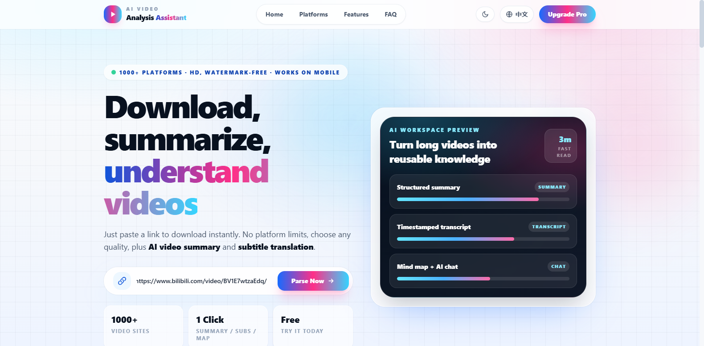
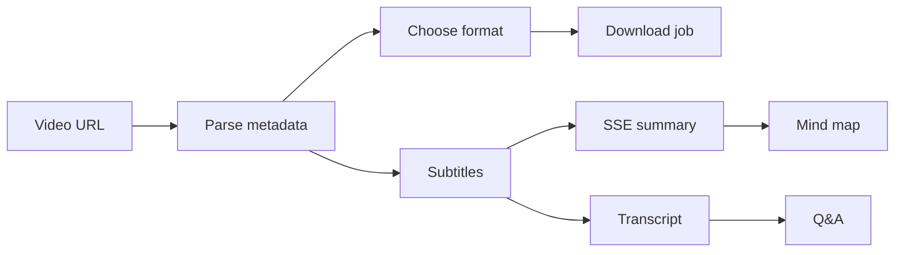

# Video Analysis Assistant

> Paste a video link once — parse metadata, pick a format, download locally, and turn subtitles into summaries, transcripts, mind maps, and grounded Q&A.

[](https://react.dev/)
[](https://vitejs.dev/)
[](https://fastapi.tiangolo.com/)
[](https://github.com/yt-dlp/yt-dlp)
[](https://tailwindcss.com/)

**Video Analysis Assistant** is a full-stack learning tool built with **React + Vite + FastAPI + yt-dlp + OpenAI-compatible LLMs**. Paste a link from YouTube, Bilibili, or any yt-dlp-supported site, then download the video and explore it through an AI workspace — without accounts, databases, or payment gates in the current codebase.

> **Compliance:** For personal learning and technical study only. Download content you own, have permission to save, or are legally allowed to use. Respect copyright, local laws, and each platform's terms.

---

## Highlights

| | |
| --- | --- |
| **1000+ sites** | Powered by yt-dlp extractors |
| **One-click parse** | Metadata, thumbnails, formats, subtitles |
| **Real downloads** | Async jobs with progress, cancel, and file retrieval |
| **AI workspace** | Summary · Transcript · Mind map · Q&A (LLM required) |
| **Light & dark UI** | Theme toggle in the navbar |

---


## Core Features

### 1. Video parsing & download

Parse returns title, uploader, duration, thumbnail, subtitle tracks, and selectable formats (best quality, resolution-specific, or audio-only MP3). Downloads run as backend jobs with live progress.

**Example — YouTube** (`https://www.youtube.com/watch?v=fWjsdhR3z3c`)

| Parsing | Dowloading |
| --- | --- |
|  |  |


---

### 2. AI video understanding

After parsing, run **Understand Video** (or use cached analysis) to open four tabs grounded in the video's subtitles. Requires an OpenAI-compatible API key in `backend/.env`.

Screenshots below use the YouTube example above, captured from the local app.

#### Summary — TL;DR, key points, and chapters

Streaming SSE output compresses long videos into structured notes.


#### Transcript — timestamped cues and search

Fetch subtitle cues, search inline, export SRT, or translate through the LLM.


#### Mind map — hierarchical knowledge view

Transcript and summary content is turned into an interactive markmap-style diagram.


#### Q&A — multi-turn chat with citations

Ask follow-up questions against the transcript and summary. The screenshot below is from the same YouTube workflow (reference capture from local testing).


---

### 3. Subtitle download & translation

- **Download Subs** exports standard SRT from parsed subtitle tracks.
- **Translate Subtitles** sends cues through an OpenAI-compatible model (LLM required).

---

## How it works



---

## Tech stack

| Layer | Technology |
| --- | --- |
| Frontend | React 18, Vite 5, Tailwind CSS 3 |
| Backend | FastAPI, Uvicorn, Pydantic |
| Download | yt-dlp, curl_cffi, ffmpeg |
| AI | OpenAI-compatible APIs (OpenAI, DeepSeek, Moonshot, Qwen, …) |
| Visualization | markmap-lib, markmap-view |
| Tests | pytest |

---

## Quick start

### Prerequisites

- Python 3.10+ (3.12 recommended for newest yt-dlp paths)
- Node.js 18+ and npm
- ffmpeg for merged HD video and MP3 conversion
- OpenAI-compatible API key for AI features (optional for parse/download)

Install ffmpeg:

```powershell
# Windows
winget install Gyan.FFmpeg
```

```bash
# macOS
brew install ffmpeg
```

### Backend

```powershell
cd backend
py -3.12 -m venv .venv312
.\.venv312\Scripts\Activate.ps1
pip install -r requirements.txt

copy .env.example .env
# Set LLM_API_KEY / LLM_BASE_URL / LLM_MODEL for AI features

uvicorn app.main:app --reload --host 0.0.0.0 --port 8000
```

API docs: `http://localhost:8000/docs`

### Frontend

```powershell
cd frontend
npm install
npm run dev
```

Open `http://localhost:5173` — Vite proxies `/api` to port 8000.

### Production-style run

```powershell
cd frontend
npm run build

cd ..\backend
uvicorn app.main:app --host 0.0.0.0 --port 8000
```

When `frontend/dist` exists, FastAPI serves the built UI from port 8000.

---

## Environment variables

Copy `backend/.env.example` to `backend/.env`:

```env
LLM_API_KEY=sk-your-api-key-here
LLM_BASE_URL=https://api.deepseek.com/v1
LLM_MODEL=deepseek-chat

DOWNLOAD_DIR=downloads
MAX_SUBTITLE_CHARS=16000
CHUNK_MAX_CHARS=6000
MAX_ANALYSIS_DURATION_SEC=7200

# Optional for login-only subtitles/media:
# YTDLP_COOKIES=C:/Users/you/bilibili-cookies.txt
# YTDLP_COOKIES_FROM_BROWSER=edge
```

Parsing and downloading work without an LLM key. AI summary, mind map, chat, and translation require LLM configuration.

---

## API overview

| Method | Path | Purpose |
| --- | --- | --- |
| `GET` | `/api/health` | Service status, ffmpeg, LLM readiness |
| `POST` | `/api/parse` | Parse metadata, subtitles, formats |
| `POST` | `/api/download/start` | Start async download |
| `GET` | `/api/download/{job_id}/progress` | Poll progress |
| `POST` | `/api/download/{job_id}/cancel` | Cancel job |
| `GET` | `/api/download/{job_id}/file` | One-shot file download |
| `POST` | `/api/summarize` | SSE streaming summary |
| `POST` | `/api/transcript` | Timestamped transcript |
| `POST` | `/api/mindmap` | Mind map JSON |
| `POST` | `/api/chat` | SSE Q&A |
| `POST` | `/api/translate` | Translate subtitles to SRT |
| `POST` | `/api/subtitles` | Subtitle metadata/text |

---

## Project structure

```text
Video-Analysis-Assistant/
├── backend/
│   ├── app/
│   │   ├── main.py
│   │   ├── downloader.py
│   │   ├── download_jobs.py
│   │   ├── summarize_service.py
│   │   ├── ai.py
│   │   └── routes/
│   ├── tests/
│   └── .env.example
├── frontend/
│   ├── src/
│   └── vite.config.js
├── docs/
│   └── assets/readme/          # README screenshots
└── README.md
```

---

## Supported platforms

The downloader follows [yt-dlp supported sites](https://github.com/yt-dlp/yt-dlp/blob/master/supportedsites.md). Development has focused on:

| Platform | Notes |
| --- | --- |
| YouTube | Anonymous parse/download; subtitles depend on the video |
| Bilibili | Parse works; some subtitles/media may need cookies |
| Instagram | Python 3.10+ and curl_cffi for newer extraction |
| TikTok, X/Twitter, Twitch, Xiaohongshu, … | Available when the yt-dlp extractor works |

Private, age-restricted, or login-only content may require `YTDLP_COOKIES` or `YTDLP_COOKIES_FROM_BROWSER`.

---

## Testing

```powershell
cd backend
pip install -r requirements-dev.txt
pytest -q
```

```powershell
cd frontend
npm run build
```

---

## Current limitations

To stay accurate about what this repo does **not** include yet:

- No user accounts, JWT authentication, Stripe payments, or database-backed history
- No batch download queue or distributed job storage
- No Whisper/ASR fallback when subtitles are missing
- No true multimodal frame analysis
- Download jobs live in memory on one backend process (not horizontally scaled)

---

## Troubleshooting

| Symptom | Likely cause | Fix |
| --- | --- | --- |
| `ffmpeg: false` in `/api/health` | ffmpeg not on PATH | Install ffmpeg and restart the backend |
| HD merge options missing | ffmpeg unavailable | Install ffmpeg or pick a direct single-file format |
| AI says no subtitles | Platform did not expose cues | Try another video or configure cookies |
| Bilibili login/cookie hint | Captions require login state | Set `YTDLP_COOKIES` or `YTDLP_COOKIES_FROM_BROWSER` |
| Platform parse fails | Extractor changed | `pip install -U yt-dlp` |
| Job lost after restart | In-memory jobs | Re-run the download |

---

## Documentation

- [AI video understanding implementation](docs/04-ai-video-understanding-implementation.md)
- [Frontend UI implementation](docs/05-frontend-ui-implementation.md)
- [Video download implementation](docs/VIDEO_DOWNLOAD.md)
- [Documentation index](docs/README.md)

---

## License & responsibility

This repository does not grant permission to download copyrighted material. Users are responsible for compliance with applicable laws and platform terms.
