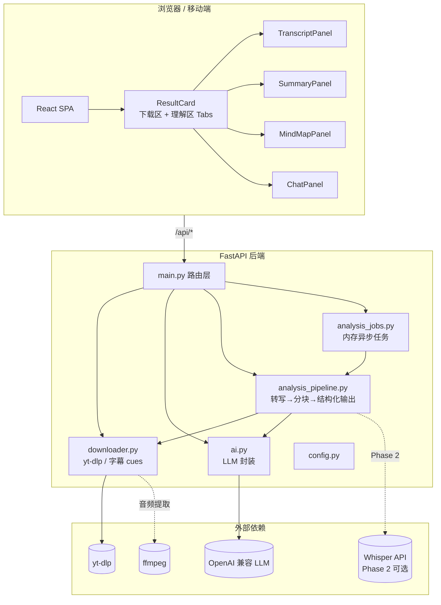
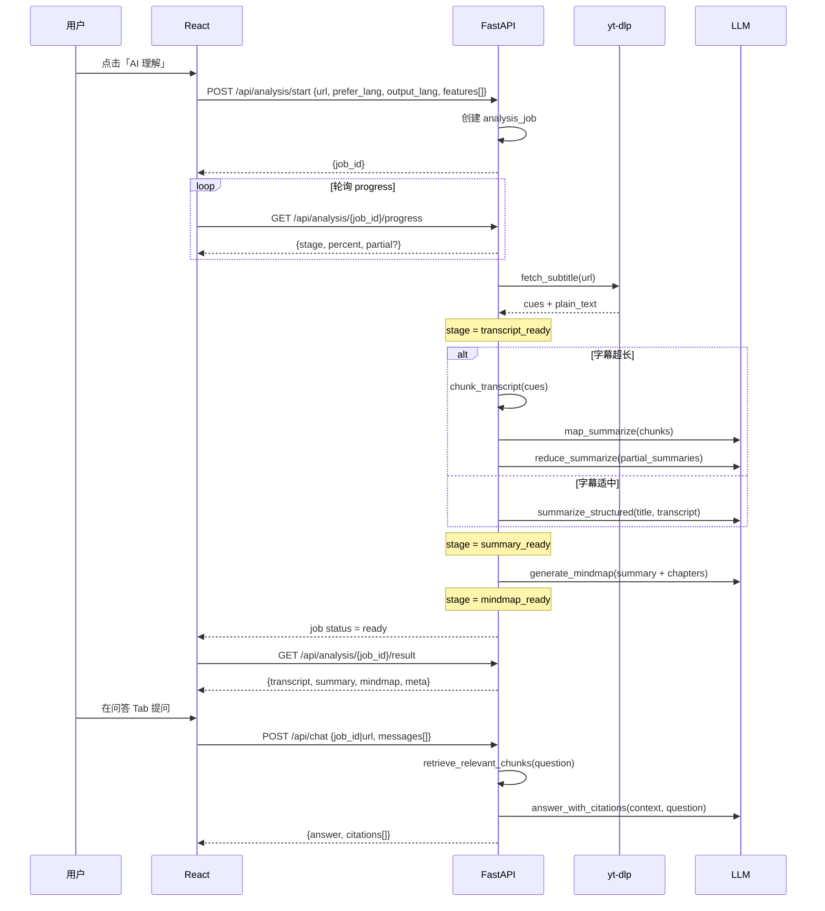

# AI 视频理解功能 · 技术方案设计

> **Historical design note**: Early design document; parts no longer match current code. Prefer [04-ai-video-understanding-implementation.md](./04-ai-video-understanding-implementation.md) (AI) and [05-frontend-ui-implementation.md](./05-frontend-ui-implementation.md) (frontend UI). Index: [README.md](./README.md).  
> **Language**: This document body is kept in Chinese as a historical archive. Authoritative English implementation docs are **04** and **05**.

> 版本：v1.0 | 对应需求：A/B/C/D 全量 AI 理解能力  
> 定位：**下载与 AI 理解并重** | 部署：**自托管优先**（用户自备 LLM Key），SaaS 商业化后续迭代  
> 本文档在 [01-requirements-analysis.md](./01-requirements-analysis.md) 与 [02-design-document.md](./02-design-document.md) 基础上，专门描述 AI 视频理解模块的 MVP 范围、架构、API、数据模型与分阶段实施计划。**本文档仅做方案设计，不含代码实现。**

---

## 1. 背景与目标

### 1.1 现状盘点

项目已完成 **Phase 3** 核心能力：

| 模块 | 已实现 | 与 AI 理解的关系 |
| --- | --- | --- |
| `downloader.py` | 解析、异步下载、字幕抓取（VTT/json3 → cues） | **字幕/转写文本的唯一数据源** |
| `ai.py` | `summarize()`、`translate_cues()` | 摘要为纯文本 Markdown；无结构化输出、无思维导图、无 Q&A |
| `main.py` | `/api/summary`、`/api/translate`、`/api/subtitles` | 摘要/翻译为同步阻塞请求；无任务进度 |
| `ResultCard.jsx` | 下载进度条、摘要文本块、字幕 SRT 导出 | **无**字幕时间轴 UI、**无** Tab 分区、**无**思维导图与 Q&A |

已知限制（来自现有文档与代码）：

- 无字幕视频无法摘要/翻译（Whisper 尚未集成）。
- 长视频字幕受 `MAX_SUBTITLE_CHARS=16000` 截断，无分块 Map-Reduce。
- AI 请求同步阻塞，长视频 LLM 调用可能超时。
- 摘要以 `whitespace-pre-wrap` 纯文本展示，不可点击跳转、不可导出结构化数据。

### 1.2 本期目标（用户已确认）

在保持「轻量、无数据库、自托管」原则下，实现四大 AI 理解功能：

| 编号 | 功能 | 优先级 | 说明 |
| --- | --- | --- | --- |
| **A** | 视频摘要/abstract | **P0 核心** | OpenAI 兼容 API；结构化输出（TL;DR + 要点 + 章节大纲） |
| **B** | 字幕/转写文本 + 时间戳展示 | P0 | 页面内可读、可搜索、可点击时间戳（v1 跳转提示，v1.1 接播放器） |
| **C** | 思维导图可视化 | P1 | 由摘要/章节树生成，可交互展开/折叠 |
| **D** | AI 问答（基于视频内容） | P1 | 多轮对话，答案需引用时间戳/片段 |

**产品定位**：解析结果页中，「下载区」与「理解区」视觉权重相当——用户粘贴链接后，既可一键下载，也可一键「理解视频」。

**部署模式**：v1 全部走 `backend/.env` 中的 `LLM_API_KEY`；前端不接触密钥。SaaS 阶段的按量计费、多租户 Key 托管不在 v1 范围。

---

## 2. MVP 范围与用户故事

### 2.1 MVP 边界（In Scope）

| 能力 | MVP 包含 | MVP 不包含 |
| --- | --- | --- |
| 字幕来源 | yt-dlp 手动字幕 + 平台自动字幕 | Whisper 本地/云端 ASR（**Phase 2 可选**） |
| 摘要语言 | 跟随 UI 语言（中/英） | 用户自定义任意语言 |
| 摘要结构 | TL;DR、要点列表、章节大纲（带时间范围） | 多模态（画面帧分析） |
| 字幕展示 | 全量 cues 列表 + 搜索 + 导出 SRT | 内嵌视频播放器同步高亮 |
| 思维导图 | 2–3 层树形图，基于章节大纲生成 | 自由编辑节点、协作、云端保存 |
| Q&A | 基于完整 transcript 的单会话多轮问答 | 跨视频知识库、向量数据库 |
| 持久化 | 前端 session 内存 + 可选 localStorage 缓存 | 服务端 DB、用户账号 |
| 长视频 | ≤ 2h 字幕分块 Map-Reduce 摘要 | 无限时长 guarantee |

### 2.2 用户故事

#### US-A1：快速了解长视频（摘要 P0）

> **作为** 自学者，**我希望** 粘贴课程链接后一键生成结构化摘要，**以便** 在 30 秒内判断是否值得完整观看。

**验收标准：**

- 点击「AI 理解」或 Tab「摘要」后，展示 TL;DR（1 句）、3–6 条要点、按时间顺序的章节大纲。
- 章节条目含 `start_time` / `end_time`（从字幕 cues 推断或 LLM 标注）。
- 输出语言与 UI 语言一致。
- 无字幕时给出明确引导（「该视频无字幕，暂无法 AI 理解」+ Whisper 即将支持说明）。

#### US-B1：阅读带时间戳的字幕（转写展示 P0）

> **作为** 语言学习者，**我希望** 在页面内浏览带时间戳的字幕全文，**以便** 对照学习并导出 SRT。

**验收标准：**

- 「字幕」Tab 展示 cues 列表：`[00:01:23] 文本内容`。
- 支持字幕语言切换（复用 parse 返回的 `subtitle_langs`）。
- 支持关键词搜索/filter。
- 保留现有「下载 SRT」「AI 翻译并下载 SRT」能力。

#### US-C1：思维导图总览知识结构（P1）

> **作为** 内容创作者，**我希望** 看到视频内容的思维导图，**以便** 快速把握论证结构与主题分支。

**验收标准：**

- 「思维导图」Tab 渲染可交互树图（根节点 = 视频标题，子节点 = 章节/要点）。
- 点击叶节点显示对应摘要片段；v1 可展示关联时间戳文本。
- 支持导出 PNG/SVG（Phase 2）或 v1 仅屏幕内浏览。

#### US-D1：针对视频内容提问（Q&A P1）

> **作为** 用户，**我希望** 就视频内容自由提问并获得带依据的回答，**以便** 不用通看全片也能找到答案。

**验收标准：**

- 「问答」Tab 提供聊天输入框与历史消息列表。
- 回答中引用 `[mm:ss]` 时间戳或「第 N 段字幕」。
- 同一次解析 session 内保留多轮上下文（前端 state；刷新页面清空）。
- LLM 未配置时禁用并展示配置指引。

#### US-E1：下载与理解并重（体验 P0）

> **作为** 用户，**我希望** 解析完成后同时看到下载选项和 AI 理解入口，**以便** 按需选择路径。

**验收标准：**

- ResultCard 分为 **「下载」** 与 **「AI 理解」** 两大区块（或左右/上下 Tab），视觉权重均衡。
- 「一键理解」按钮触发 transcript 拉取 + 摘要 + 思维导图数据预生成（可异步分步完成）。

---

## 3. 系统架构

### 3.1 总体架构图



### 3.2 核心设计原则

1. **Transcript 一次拉取，多处复用**：摘要、思维导图、Q&A 共用同一份 `Transcript` 对象，避免重复调用 yt-dlp。
2. **结构化 LLM 输出优先**：摘要、思维导图要求 JSON Schema 响应（`response_format: json_object` 或 prompt 约束 + 解析校验），便于前端渲染。
3. **长视频分块 Map-Reduce**：超过 token 阈值时，按时间窗口分块摘要再合并，Q&A 采用「检索相关块 + 回答」的轻量 RAG。
4. **异步任务对齐下载模式**：AI 分析复用 `download_jobs.py` 的设计模式——内存 job + 轮询 progress，避免 HTTP 超时。
5. **自托管零数据库**：分析结果随 job 存在于内存；前端可选将最近一次结果写入 `localStorage`（ keyed by url hash）。

### 3.3 理解流水线（Sequence）



---

## 4. API 设计

### 4.1 现有端点（保留 / 微调）

| 方法 | 路径 | 变更 |
| --- | --- | --- |
| GET | `/api/health` | **扩展** 返回 `whisper_ready`、`analysis_features` |
| POST | `/api/parse` | 不变 |
| POST | `/api/subtitles` | 不变；理解区「导出 SRT」继续复用 |
| POST | `/api/translate` | 不变 |
| POST | `/api/summary` | **标记 deprecated**；内部转调新 pipeline，兼容旧前端 |

### 4.2 新增端点

#### 4.2.1 统一分析任务（推荐主入口）

| 方法 | 路径 | 说明 |
| --- | --- | --- |
| POST | `/api/analysis/start` | 启动异步 AI 理解任务 |
| GET | `/api/analysis/{job_id}/progress` | 查询阶段与进度 |
| GET | `/api/analysis/{job_id}/result` | 任务完成后获取完整结构化结果 |
| POST | `/api/analysis/{job_id}/cancel` | 取消进行中的 LLM 调用（best-effort） |

**POST `/api/analysis/start` 请求体：**

```json
{
  "url": "https://www.youtube.com/watch?v=...",
  "prefer_lang": "zh-Hans",
  "output_lang": "Simplified Chinese",
  "features": ["summary", "mindmap"],
  "force_refresh": false
}
```

| 字段 | 类型 | 说明 |
| --- | --- | --- |
| `url` | string | 视频链接（必填） |
| `prefer_lang` | string? | 字幕语言偏好，默认自动 |
| `output_lang` | string | 摘要/导图/Q&A 回答语言，默认 English |
| `features` | string[] | 要生成的能力：`summary` \| `mindmap`；`transcript` 始终包含 |
| `force_refresh` | bool | 忽略内存缓存强制重新分析 |

**响应：**

```json
{ "job_id": "a1b2c3...", "cached": false }
```

**GET `/api/analysis/{job_id}/progress` 响应：**

```json
{
  "stage": "summarizing",
  "percent": 45,
  "ready": false,
  "error": null,
  "stages_completed": ["transcript", "chunking"],
  "partial": {
    "transcript": { "lang": "en", "is_auto": true, "cue_count": 842 }
  }
}
```

`stage` 枚举：`starting` → `fetching_transcript` → `chunking` → `summarizing` → `generating_mindmap` → `ready` | `error` | `cancelled`

**GET `/api/analysis/{job_id}/result` 响应：** 见 §5 数据模型 `AnalysisResult`。

#### 4.2.2 字幕/转写（同步轻量接口）

| 方法 | 路径 | 说明 |
| --- | --- | --- |
| POST | `/api/transcript` | 仅拉取字幕 cues（不调用 LLM），供 Tab 快速展示 |

**请求体：** `{ "url", "prefer_lang"? }`

**响应：**

```json
{
  "title": "视频标题",
  "lang": "en",
  "is_auto": true,
  "duration": 372,
  "cues": [
    { "index": 0, "start": "00:00:01,000", "end": "00:00:04,500", "start_sec": 1.0, "end_sec": 4.5, "text": "..." }
  ],
  "plain_text": "...",
  "truncated": false,
  "source": "subtitle"
}
```

`source` 枚举：`subtitle` | `whisper`（Phase 2）

#### 4.2.3 AI 问答

| 方法 | 路径 | 说明 |
| --- | --- | --- |
| POST | `/api/chat` | 基于视频 transcript 的多轮问答 |

**请求体：**

```json
{
  "url": "https://...",
  "job_id": "a1b2c3...",
  "messages": [
    { "role": "user", "content": "作者在第几分钟提到 XX？" }
  ],
  "output_lang": "Simplified Chinese",
  "prefer_lang": "en"
}
```

`job_id` 与 `url` 二选一；优先使用 `job_id` 关联已缓存的 transcript/chunks。

**响应：**

```json
{
  "answer": "作者在 03:24 附近提到……",
  "citations": [
    { "start_sec": 204.0, "end_sec": 218.0, "quote": "原文片段...", "cue_index": 42 }
  ],
  "model": "deepseek-chat"
}
```

#### 4.2.4 思维导图单独刷新（可选）

| 方法 | 路径 | 说明 |
| --- | --- | --- |
| POST | `/api/mindmap` | 基于已有 summary 重新生成导图（调参/重试） |

**请求体：** `{ "url", "job_id"?, "output_lang" }`

一般通过 `/api/analysis/start` 一次性生成即可；此端点用于「仅重绘导图」边缘场景。

### 4.3 错误码约定

| HTTP | 场景 |
| --- | --- |
| 400 | URL 为空、参数非法 |
| 404 | analysis job 不存在 |
| 422 | 无字幕且 Whisper 未启用、字幕为空、yt-dlp 失败 |
| 503 | LLM Key 未配置 |
| 502 | LLM 调用失败、JSON 解析失败（重试后仍失败） |
| 409 | 任务未完成就请求 result |

错误体统一：`{"detail": "..."}`

---

## 5. 数据模型

### 5.1 Transcript（字幕/转写）

```typescript
interface Transcript {
  title: string;
  url: string;
  lang: string;           // BCP-47，如 "zh-Hans", "en"
  is_auto: boolean;       // 是否平台自动生成字幕
  duration_sec: number | null;
  source: "subtitle" | "whisper";
  cues: TranscriptCue[];
  plain_text: string;     // cues 拼接，供 LLM 输入
  char_count: number;
  truncated: boolean;     // 是否被 max_subtitle_chars 截断（仅 plain_text）
}

interface TranscriptCue {
  index: number;
  start: string;          // SRT 格式 "HH:MM:SS,mmm"
  end: string;
  start_sec: number;      // 浮点秒，便于排序/跳转
  end_sec: number;
  text: string;
}
```

### 5.2 Summary（结构化摘要）

```typescript
interface VideoSummary {
  tldr: string;                    // 一句话概述
  key_points: string[];            // 3–6 条要点
  chapters: Chapter[];             // 章节大纲（带时间）
  tags?: string[];                 // 可选主题标签
  output_lang: string;
  generated_at: string;            // ISO8601
}

interface Chapter {
  title: string;
  summary: string;                 // 该章节 1–2 句摘要
  start_sec: number;
  end_sec: number;
  start_label: string;             // "03:24"
  end_label: string;
}
```

**章节时间对齐策略：**

1. LLM 输出章节标题 + 描述 +  approximate `start_label`（`mm:ss` 或 `hh:mm:ss`）。
2. 后端 `align_chapter_times(cues, chapters)`：将 label 映射到最近 cue 的 `start_sec`；`end_sec` 取下一章 `start_sec` 或视频结束。

### 5.3 MindMap（思维导图）

```typescript
interface MindMapNode {
  id: string;                      // 稳定 id，如 "root", "ch-0", "kp-2"
  label: string;
  type: "root" | "chapter" | "point" | "detail";
  start_sec?: number;              // 可点击跳转
  children: MindMapNode[];
}

interface MindMap {
  root: MindMapNode;
  layout: "tree";                  // v1 固定树形
  node_count: number;
}
```

**生成策略：**

- **主路径（推荐）**：由 `VideoSummary`  deterministic 转换——root → chapters → key_points 挂到最相关 chapter 下；无需额外 LLM 调用，成本低、结构稳定。
- **增强路径（可选）**：额外一次 LLM 调用，输入 summary JSON，输出 MindMap JSON；用于章节粒度较粗时的细化。

### 5.4 Chat（问答）

```typescript
interface ChatMessage {
  role: "user" | "assistant" | "system";
  content: string;
  citations?: Citation[];
  created_at?: string;
}

interface Citation {
  start_sec: number;
  end_sec: number;
  quote: string;
  cue_index: number;
}

interface ChatRequest {
  url?: string;
  job_id?: string;
  messages: ChatMessage[];
  output_lang: string;
}

interface ChatResponse {
  answer: string;
  citations: Citation[];
}
```

**上下文窗口策略：**

- 短视频（plain_text ≤ `MAX_SUBTITLE_CHARS`）：system prompt 嵌入完整 transcript。
- 长视频：预计算 `TranscriptChunk[]`（见 §6.3），对用户问题做 keyword + 简单 BM25/重叠度检索 Top-K 块（K=3~5），仅将相关块 + 摘要 TL;DR 送入 LLM。

### 5.5 AnalysisResult（聚合响应）

```typescript
interface AnalysisResult {
  job_id: string;
  meta: {
    title: string;
    url: string;
    thumbnail?: string;
    duration_sec?: number;
    extractor?: string;
  };
  transcript: Transcript;
  summary: VideoSummary | null;
  mindmap: MindMap | null;
  features: string[];
}
```

### 5.6 内存 Job 状态（`analysis_jobs.py`）

```python
@dataclass
class AnalysisJob:
    job_id: str
    url: str
    stage: str
    percent: int | None
    error: str | None
    transcript: dict | None
    chunks: list[dict] | None      # 长视频分块
    summary: dict | None
    mindmap: dict | None
    created_at: float
    _cancelled: bool
```

**缓存键：** `sha256(normalize_url + prefer_lang)` → 已完成 job 可 short-circuit 返回（TTL 建议 30min，可配置 `ANALYSIS_CACHE_TTL`）。

---

## 6. 后端实现计划

### 6.1 模块划分

```
backend/app/
├── main.py                 # 新增 analysis/chat/transcript 路由
├── downloader.py           # 扩展：extract_audio() Phase 2
├── ai.py                   # 扩展：结构化摘要、Q&A、可选 mindmap LLM
├── analysis_pipeline.py    # 新建：编排 transcript → chunk → summarize → mindmap
├── analysis_jobs.py        # 新建：异步任务 + 缓存（镜像 download_jobs.py）
├── transcript_utils.py     # 新建：分块、时间对齐、检索、cues 增强字段
└── config.py               # 扩展 AI 相关配置项
```

### 6.2 `ai.py` 扩展

| 函数 | 职责 |
| --- | --- |
| `summarize_structured(title, transcript, output_lang) -> VideoSummary` | JSON 模式输出；prompt 要求 tldr/key_points/chapters |
| `map_summarize_chunk(title, chunk_text, chunk_index, total) -> dict` | Map 阶段局部摘要 |
| `reduce_summaries(title, partials, output_lang) -> VideoSummary` | Reduce 合并 |
| `answer_question(title, context_chunks, summary_tldr, messages, output_lang) -> ChatResponse` | Q&A + 引用解析 |
| `translate_cues(...)` | **保留**现有实现 |
| `summarize(...)` | **保留**兼容旧 `/api/summary`，内部可委托 `summarize_structured` 再转 Markdown |

**Prompt 要点：**

- 摘要：强调忠实原文、禁止幻觉、章节必须带 approximate 时间标记。
- Q&A：要求「不知道则说明」；回答末尾列出 `[mm:ss]` 引用；仅依据提供的 transcript 片段。

**JSON 解析容错：**

- 优先 `response_format={"type":"json_object"}`（若模型支持）。
- 失败时 regex 提取 `{...}` + `json.loads`；仍失败则重试 1 次；最终返回 502。

### 6.3 长视频分块策略（`transcript_utils.py`）

```python
def chunk_transcript(cues: list, max_chars: int = 6000, overlap_cues: int = 2) -> list[TranscriptChunk]:
    """
    按字符预算滑动窗口切分，边界对齐 cue 整句。
    每块附带：chunk_index, start_sec, end_sec, text, cue_range
    """
```

| 视频时长 | 策略 |
| --- | --- |
| ≤ 20min 或 chars ≤ `MAX_SUBTITLE_CHARS` | 单次 `summarize_structured` |
| 20min – 2h | Map-Reduce：每块 4k–6k 字符 → 局部摘要 → reduce |
| > 2h | 同上，但 UI 提示「超长视频，摘要可能不完整」；Q&A 仅检索模式 |

**Reduce prompt：** 输入各块 `{start_label, partial_tldr, partial_points, partial_chapters}`，输出合并后的 `VideoSummary`，去重相邻相似章节。

### 6.4 Whisper 集成（Phase 2，方案预埋）

| 配置项 | 说明 |
| --- | --- |
| `WHISPER_MODE` | `off` \| `openai_api` \| `local` |
| `WHISPER_MODEL` | 如 `whisper-1`（API）或 `base`/`small`（local faster-whisper） |
| `WHISPER_MAX_DURATION_SEC` | 默认 3600，超限拒绝 ASR |

**流程：**

1. `fetch_subtitle` 失败或无字幕 → 检查 `WHISPER_MODE`。
2. `downloader.extract_audio(url)` → ffmpeg 提取 m4a/mp3 到 temp dir。
3. 调用 Whisper → cues（需将 segment timestamps 转为 SRT 格式）。
4. 后续 pipeline 与字幕路径完全一致。

**v1 默认：** `WHISPER_MODE=off`，API `/api/health` 返回 `whisper_ready: false`。

### 6.5 `analysis_jobs.py` 设计要点

- 复用 `download_jobs.py` 的线程 + 锁模式。
- 单进程内存 dict；**服务重启后 job 失效**（与下载 job 一致，文档明确说明）。
- Progress 百分比估算：`fetching_transcript` 10% → `chunking` 20% → `summarizing` 20–80%（按 chunk 递增）→ `generating_mindmap` 90% → `ready` 100%。
- Cancel：设置 `_cancelled` flag；LLM 请求无法硬中断，但在 chunk 间隙检查 cancel。

### 6.6 `config.py` 新增配置

```env
# ===== AI 理解扩展 =====
MAX_SUBTITLE_CHARS=16000          # 已有；plain_text 上限
CHUNK_MAX_CHARS=6000              # Map 分块大小
ANALYSIS_CACHE_TTL=1800           # 秒，0=禁用缓存
CHAT_TOP_K_CHUNKS=4               # Q&A 检索块数

# ===== Whisper（Phase 2）=====
WHISPER_MODE=off                  # off | openai_api | local
WHISPER_API_KEY=                  # 可独立于 LLM_KEY
WHISPER_MODEL=whisper-1
WHISPER_MAX_DURATION_SEC=3600
```

---

## 7. 前端 UI/UX 方案

### 7.1 ResultCard 信息架构重构

```
ResultCard
├── Header（封面 + 标题 + 元信息）          ← 保留
├── Section A: 下载区                      ← 保留，略压缩
│   ├── 清晰度选择
│   ├── 下载进度条
│   └── 主按钮：下载 / 取消
└── Section B: AI 理解区（新增，视觉权重 ≈ 下载区）
    ├── CTA：「一键 AI 理解」+ 阶段进度
    └── Tabs
        ├── [摘要]   SummaryPanel
        ├── [字幕]   TranscriptPanel
        ├── [思维导图] MindMapPanel
        └── [问答]   ChatPanel
```

**布局建议（桌面）：**

- 下载区与理解区采用 **上下双卡片** 或 **Tab 一级「下载 | 理解」** 切换；推荐 **同屏上下**，避免用户忽略理解能力。
- 移动端：理解区 Tabs 可横向 scroll；「一键理解」sticky 于理解区顶部。

### 7.2 组件清单

| 组件 | 文件 | 职责 |
| --- | --- | --- |
| `UnderstandingSection` | `components/UnderstandingSection.jsx` | 理解区容器、一键分析、progress |
| `SummaryPanel` | `components/SummaryPanel.jsx` | TL;DR 卡片 + 要点列表 + 章节时间轴 |
| `TranscriptPanel` | `components/TranscriptPanel.jsx` | 虚拟滚动 cues 列表、搜索、语言切换 |
| `MindMapPanel` | `components/MindMapPanel.jsx` | 树形图渲染、节点点击 |
| `ChatPanel` | `components/ChatPanel.jsx` | 消息列表 + 输入框 + citations 展示 |
| `AnalysisProgress` | `components/AnalysisProgress.jsx` | 阶段 stepper（转写→摘要→导图） |

### 7.3 状态管理

**方案 A（推荐 MVP）：** 状态提升至 `ResultCard` 或新建 `UnderstandingSection`：

```javascript
// understanding state
{
  analysisJobId: null,
  analysisProgress: null,   // { stage, percent, stages_completed }
  analysisResult: null,     // AnalysisResult
  activeTab: "summary",     // summary | transcript | mindmap | chat
  chatMessages: [],         // ChatMessage[]
  chatLoading: false,
  transcriptSearch: "",
}
```

**数据流：**

1. 用户点击「AI 理解」→ `startAnalysis(url)` → 轮询 → `getAnalysisResult(jobId)`。
2. 切换至「字幕」Tab 时，若已有 `analysisResult.transcript` 直接渲染；否则可调用轻量 `/api/transcript`。
3. Q&A 发送 → `postChat({ job_id, messages })` → append assistant message。
4. 可选：`localStorage` 缓存 `analysisResult`（key=`analysis:${urlHash}`，TTL 24h）。

### 7.4 交互细节

| 场景 | 行为 |
| --- | --- |
| 无字幕 | 「AI 理解」按钮 disabled + tooltip「暂无字幕；Whisper 转写即将支持」 |
| LLM 未配置 | 理解区展示配置指引（复用 `llm_hint`） |
| 分析进行中 | Tabs 可点击但内容区 skeleton；摘要 Tab 可 stream partial meta |
| 章节/引用时间戳点击 | v1：scroll 到 TranscriptPanel 对应 cue 并高亮；toast「播放器同步即将支持」 |
| 思维导图节点点击 | 侧边 drawer 展示节点 label + summary 片段 + 时间戳 |
| 翻译字幕 | 保留独立按钮于 TranscriptPanel 工具栏 |

### 7.5 思维导图技术选型

| 方案 | 库 | 优点 | 缺点 |
| --- | --- | --- | --- |
| **A（推荐）** | `@xyflow/react`（React Flow） | 布局可控、节点自定义、社区活跃 | 需新增依赖 (~45kb gzip) |
| B | `markmap-view` + `markmap-lib` | Markdown 转导图，轻量 | 交互性较弱 |
| C | 纯 CSS 树形缩进 | 零依赖 | 大图性能差、不够「导图」感 |

**v1 推荐 React Flow：** 后端输出 `MindMapNode` 树 → 前端转换为 nodes/edges → 自动 `dagre` 或 `elk` 布局（仅引入 layout 算法）。

### 7.6 i18n 扩展键位（示例）

```javascript
understanding: {
  title: "AI 视频理解",
  one_click: "一键 AI 理解",
  analyzing: "分析中…",
  tab_summary: "摘要",
  tab_transcript: "字幕",
  tab_mindmap: "思维导图",
  tab_chat: "问答",
  tldr: "一句话总结",
  key_points: "核心要点",
  chapters: "章节大纲",
  search_transcript: "搜索字幕…",
  ask_placeholder: "关于这个视频，想问什么？",
  no_subtitles: "该视频无可用字幕，暂无法 AI 理解",
  citation_at: "引用 {time}",
  ...
}
```

### 7.7 API 层扩展（`api.js`）

```javascript
export async function startAnalysis(url, { preferLang, outputLang, features, signal })
export async function getAnalysisProgress(jobId, { signal })
export async function getAnalysisResult(jobId)
export async function fetchTranscript(url, preferLang)
export async function postChat({ url, jobId, messages, outputLang })
```

轮询间隔 500–800ms；与 `downloadVideo` 共用 `sleep` + `AbortController` 模式。

---

## 8. 分阶段实施计划

### Phase 1：理解基础（P0，约 1–1.5 周）

**目标：** 摘要结构化 + 字幕 Tab + 异步 analysis job

| 步骤 | 任务 |
| --- | --- |
| 1.1 | 新建 `transcript_utils.py`：cues 增加 `start_sec`/`end_sec`；`chunk_transcript` |
| 1.2 | 扩展 `ai.py`：`summarize_structured`、`map_summarize_chunk`、`reduce_summaries` |
| 1.3 | 新建 `analysis_pipeline.py` + `analysis_jobs.py` |
| 1.4 | `main.py` 新增 `/api/analysis/*`、`/api/transcript`；`/api/summary` 委托新 pipeline |
| 1.5 | 前端 `UnderstandingSection` + `SummaryPanel` + `TranscriptPanel` |
| 1.6 | ResultCard 布局调整：下载区 + 理解区并重 |
| 1.7 | i18n 中英文案 |
| 1.8 | 单元测试：`chunk_transcript`、JSON 解析、章节时间对齐 |

**交付验收：** 有字幕视频可一键理解；摘要含章节时间；字幕 Tab 可搜索浏览。

### Phase 2：导图与问答（P1，约 1 周）

**目标：** 思维导图 + AI Q&A

| 步骤 | 任务 |
| --- | --- |
| 2.1 | `summary_to_mindmap()` deterministic 转换 + 可选 LLM 增强 |
| 2.2 | `ai.answer_question` + `retrieve_chunks` |
| 2.3 | `main.py` 新增 `/api/chat` |
| 2.4 | 前端 `MindMapPanel`（React Flow）+ `ChatPanel` |
| 2.5 | 时间戳点击 → Transcript 高亮联动 |
| 2.6 | 集成测试：完整 analysis + chat flow |

**交付验收：** 导图可交互；问答返回带 citations；多轮对话 session 内有效。

### Phase 3：长视频与体验打磨（约 0.5–1 周）

| 步骤 | 任务 |
| --- | --- |
| 3.1 | Map-Reduce 摘要完善 + progress 细粒度 |
| 3.2 | `localStorage` 分析结果缓存 |
| 3.3 | 错误重试、友好空状态、loading skeleton |
| 3.4 | 性能：TranscriptPanel 虚拟列表（>500 cues） |
| 3.5 | 文档更新 README / FAQ |

### Phase 4：Whisper 无字幕支持（可选，约 1 周）

| 步骤 | 任务 |
| --- | --- |
| 4.1 | `downloader.extract_audio()` |
| 4.2 | OpenAI Whisper API 或 `faster-whisper` 本地 |
| 4.3 | `/api/health.whisper_ready` + UI 无字幕路径 |
| 4.4 | 成本/时长限制与 UI 提示 |

### Phase 5：SaaS 预埋（后续，不在 v1）

- 用户 BYOK → 平台托管 Key 的抽象层（`LLMProvider` interface）
- 用量计数、Rate limit、PRO 功能门控
- 持久化 DB（SQLite/Postgres）存 analysis history

---

## 9. 测试策略

### 9.1 后端单元测试

| 模块 | 用例 |
| --- | --- |
| `transcript_utils` | 空 cues、单 cue、chunk 边界、overlap、sec 转换 |
| `transcript_utils.align_chapter_times` | LLM 输出多种时间格式对齐 |
| `ai.summarize_structured` | mock OpenAI client，断言 JSON schema |
| `ai.answer_question` | mock 检索结果，断言 citations 解析 |
| `analysis_jobs` | 创建/进度/完成/取消/缓存 hit |
| `summary_to_mindmap` | 节点数、层级、start_sec 传递 |

### 9.2 后端集成测试

- 使用 **预录 fixture**（mock yt-dlp subtitle 内容），避免 CI 依赖外网。
- `/api/analysis/start` → poll → `/result` 全链路（mock LLM 返回固定 JSON）。
- 超长 transcript fixture 触发 Map-Reduce（assert `chunking` stage）。

### 9.3 前端测试

MVP 以 **手动测试清单** 为主（项目暂未引入 Vitest）：

| # | 场景 |
| --- | --- |
| 1 | 有字幕 YouTube 链接：一键理解 → 摘要/字幕/导图/问答均可用 |
| 2 | 无字幕视频：理解按钮 disabled + 提示 |
| 3 | LLM Key 缺失：503 友好提示 |
| 4 | 分析进行中刷新页面：job 丢失提示（或 localStorage 恢复） |
| 5 | 移动端 Tabs 滚动与布局 |
| 6 | 中英文切换后重新理解，输出语言正确 |

Phase 2+ 可引入 Vitest + React Testing Library 覆盖 `SummaryPanel`、`ChatPanel` 渲染。

### 9.4 手工 LLM 验收场景

准备 3 类样本视频：

1. **短教程（5–10min，英文字幕）**：摘要点数、章节合理性。
2. **中文访谈（30min+）**：Map-Reduce、章节时间大致准确。
3. **无字幕 MV**：确认阻断路径与提示文案。

---

## 10. v1 明确不做（Scope Control）

| 不做 | 原因 |
| --- | --- |
| 用户注册/登录/账号体系 | 自托管 v1 零 DB 原则 |
| 服务端持久化分析历史 DB | 同上；localStorage 足够 |
| 内嵌视频播放器 + 字幕同步滚动 | 复杂度高；v1 仅 cue 高亮 |
| 批量分析多个 URL | 留待「批量下载」迭代 |
| 向量数据库 / Embedding RAG | 长视频用 chunk + keyword 检索足够 MVP |
| 多模态（抽帧识图/视频原生理解） | 成本高，与「字幕驱动」路线不符 |
| 思维导图在线编辑、导出 Figma | 非核心诉求 |
| 实时 SSE 流式摘要 token | v1 轮询 progress 即可；流式 Phase 5+ |
| 前端配置 LLM Key | 安全考虑；必须后端 `.env` |
| 自动 Whisper 转写（默认） | 成本与时长不可控；Phase 4 可选开启 |
| 付费墙/Stripe/支付宝 | SaaS Phase 5 |
| 水平扩展 / 多实例 job 共享 | 内存 job；文档声明单实例 |
| 非 OpenAI 兼容 API 的适配层 | v1 统一 OpenAI SDK；特殊厂商后续 |

---

## 11. 风险与缓解

| 风险 | 影响 | 缓解 |
| --- | --- | --- |
| LLM 输出 JSON 不稳定 | 摘要/导图失败 | JSON mode + 重试 + fallback 纯文本摘要 |
| 长视频 LLM 超时 | 用户等待失败 | 异步 job + Map-Reduce + 前端 progress |
| 平台无字幕比例高 | 理解功能不可用 | Phase 4 Whisper；v1 明确提示 |
| 章节时间不准 | 点击跳转体验差 | `align_chapter_times` 启发式 + UI 标注「约」 |
| React Flow 包体积 | 首屏变慢 | 路由级 lazy import `MindMapPanel` |
| 内存 job 重启丢失 | 用户需重新分析 | localStorage 缓存 + 友好提示 |
| LLM 幻觉 | 错误答案 | Q&A prompt 约束 + citations 必引原文 |

---

## 12. 与现有文档的关系

| 文档 | 关系 |
| --- | --- |
| [01-requirements-analysis.md](./01-requirements-analysis.md) | 业务需求来源；F3/F4 已实现部分需更新状态 |
| [02-design-document.md](./02-design-document.md) | 总体架构基线；本方案为其 AI 理解子域扩展 |
| [VIDEO_DOWNLOAD.md](./VIDEO_DOWNLOAD.md) | 下载异步 job 模式为本方案 analysis job 的参考实现 |

**实施完成后建议回写：**

- `01-requirements-analysis.md` §3.3 扩展功能状态
- `02-design-document.md` §10 扩展点表格
- `README.md` AI 理解功能说明

---

## 13. 待确认事项（Decision Log）

以下问题建议在开发启动前由产品/用户确认：

| # | 问题 | 方案建议 | 默认决策（若无回复） |
| --- | --- | --- | --- |
| Q1 | 无字幕视频 v1 是否必须支持？ | Phase 4 做 Whisper；v1 仅提示 | **v1 不支持**，Phase 4 可选 |
| Q2 | Whisper 方案偏好？ | OpenAI API（简单）vs faster-whisper 本地（隐私） | 自托管默认 **local faster-whisper** |
| Q3 | 思维导图生成方式？ | Deterministic（无额外 LLM）vs LLM 生成 | **Deterministic 为主** |
| Q4 | 摘要/导图/Q&A 导出格式？ | Markdown / JSON / PNG 导图 | **v1 不导出**；Phase 3 加 Markdown |
| Q5 | 长视频上限？ | 2h 硬限制 vs 仅警告 | **2h 警告 + Map-Reduce**，不硬拦 |
| Q6 | 分析结果是否存 localStorage？ | 24h TTL 自动恢复 | **是**，key=`analysis:{hash}` |
| Q7 | 旧 `/api/summary` 是否保留？ | 兼容 1 个版本 | **保留 deprecated** |
| Q8 | 理解区是否与下载区同屏？ | 同屏 vs Tab 切换 | **同屏上下布局** |

---

*文档版本：v1.0 | 状态：方案设计完成，待评审后进入 Phase 1 开发*
