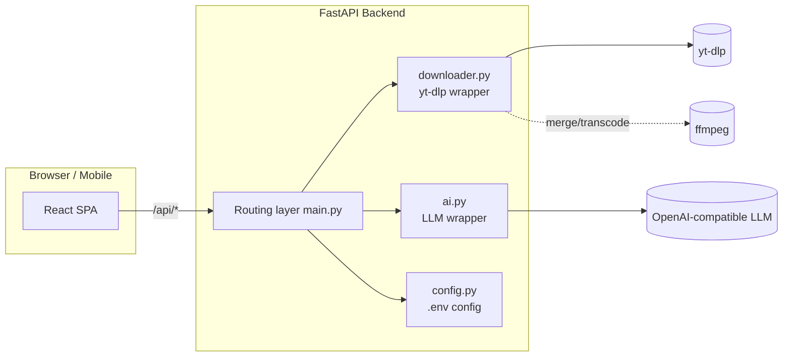
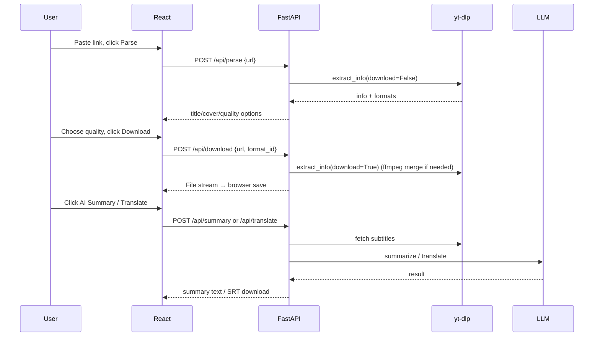

# Design Document · Video Analysis Assistant (Universal Video Downloader)

> Version: v1.0 | Corresponding implementation: Phase 3 (core business flow working)
> This document describes the system architecture, module design, API contract, key flows, directory structure, configuration, and extension points. It serves as the technical baseline for future iterations.

## 1. Tech Stack

| Layer | Technology | Notes |
| --- | --- | --- |
| Frontend | React 18 + Vite 5 + Tailwind CSS 3 | Component-based, fast builds, efficient styling |
| Backend | FastAPI + Uvicorn | Lightweight, async, built-in `/docs` |
| Download core | yt-dlp | Wrapped directly, source unmodified; supports 1000+ platforms |
| AI | openai SDK (OpenAI-compatible protocol) | Configurable `base_url`/`model`/`api_key`; switch any compatible service |
| Merge/transcode | ffmpeg | HD merge, MP3 transcode; auto-degrades when missing |
| Config | python-dotenv + `.env` | Secrets stay in the backend |

Design principles: **stand on the shoulders of giants** (reuse yt-dlp), **lightweight and database-free**, **frontend/backend separation**, **never send secrets to the frontend**.

## 2. System Architecture



- Development: the Vite dev server (:5173) proxies `/api` to FastAPI (:8000).
- Production: `npm run build` produces `frontend/dist`, mounted by FastAPI at `/` and served from a single port.

## 3. Backend Module Design

### 3.1 `config.py`
- Reads `.env` and exposes `Settings`: `llm_api_key/llm_base_url/llm_model`, `download_dir`, `max_subtitle_chars`, `host/port`.
- `llm_ready`: whether a valid key is configured (placeholder counts as not configured).
- `get_settings()` is a singleton via `lru_cache`; the download directory is created on init.

### 3.2 `downloader.py` (yt-dlp wrapper, core)
- `has_ffmpeg()`: detection via `shutil.which`.
- `parse(url)`: `extract_info(download=False)` → normalized return; playlists take the first entry; calls `_build_quality_options` to build quality options.
- `_build_quality_options(info)`: aggregates the best format per resolution height and outputs a unified structure:
  - `id` (format selector), `label` (backend fallback text), `ext`, `height`, `filesize`, `needs_merge`, `recommended`, `audio_only`.
  - `height` convention: `99999` = best quality, `>0` = specific tier, `0` = default, `-1` = audio only (the frontend localizes text based on this).
  - Without ffmpeg, video-only streams needing a merge are skipped, and audio-only degrades to m4a.
- `download(url, format_id)`: downloads to `downloads/<uuid>/` and returns the largest file; `audio-mp3` uses `FFmpegExtractAudio`; selectors containing `+`/`best` set `merge_output_format=mp4`.
- `fetch_subtitle(url, prefer_langs)`: prefers manual subtitles, then auto captions; prefers vtt, falling back to srv/ttml/json3; parses into `cues[{start,end,text}]` and `plain_text` (truncated by `max_subtitle_chars`).
- `cues_to_srt(cues)`: cues → standard SRT text.

### 3.3 `ai.py` (LLM wrapper)
- `summarize(title, transcript)`: structured summary (TL;DR + key points + outline).
- `translate_cues(cues, target_lang)`: translates line by line with `[index]` prefixes and restores by index, keeping the timeline unchanged.
- Raises a clear error when no key is configured.

### 3.4 `main.py` (routing + hosting)
- Unified exceptions → `HTTPException`; `_clean_err` strips yt-dlp noise.
- Download uses `FileResponse` + `BackgroundTask` to clean up the temp directory after sending.
- Production mounts `frontend/dist` (only if it exists, to avoid dev-time errors).

## 4. API Contract

Base: `/api` | Interactive docs: `http://localhost:8000/docs`

| Method | Path | Request body | Response |
| --- | --- | --- | --- |
| GET | `/api/health` | - | `{status, ffmpeg, llm_ready}` |
| POST | `/api/parse` | `{url}` | Video info + `options[]` (see below) |
| POST | `/api/download` | `{url, format_id}` | File stream (`Content-Disposition` with filename) |
| POST | `/api/summary` | `{url}` | `{title, lang, is_auto, summary}` |
| POST | `/api/translate` | `{url, target_lang}` | SRT text (`application/x-subrip`) |

`/api/parse` response example:
```json
{
  "id": "abc",
  "title": "Sample video",
  "uploader": "Author",
  "thumbnail": "https://.../cover.jpg",
  "duration": 372,
  "duration_string": "6:12",
  "webpage_url": "https://...",
  "extractor": "Youtube",
  "has_subtitles": true,
  "subtitle_langs": ["en", "zh-Hans"],
  "ffmpeg": true,
  "options": [
    {"id": "bestvideo+bestaudio/best", "height": 99999, "ext": "mp4", "needs_merge": true, "recommended": true},
    {"id": "137+bestaudio/best", "height": 1080, "ext": "mp4", "needs_merge": true, "filesize": "48.2MB"},
    {"id": "18", "height": 360, "ext": "mp4", "needs_merge": false, "filesize": "12.1MB"},
    {"id": "audio-mp3", "height": -1, "ext": "mp3", "audio_only": true}
  ]
}
```

Error convention: non-2xx returns `{"detail": "..."}`, and the frontend `api.js` uniformly throws `Error(detail)` for display.

## 5. Key Flow (Sequence)



## 6. Frontend Design

### 6.1 Component Structure
```
App
├─ Navbar          Top bar: logo / menu / language toggle / Upgrade Pro
├─ Hero            Headline + pill input + parse
├─ ResultCard      Parse result: cover/info/quality/download/AI summary/translate
├─ PlatformGallery Popular platforms card gallery
├─ FeatureSection  Feature highlights (Free/PRO badges)
├─ ProCTA          Upgrade Pro call-to-action
└─ Footer          FAQ / Features / About / copyright notice
```

### 6.2 State and Data
- `App` holds `url / loading / error / result / llmReady`; `health` drives the AI hint.
- `ResultCard` manages its own loading and results for download/summary/translate.
- `api.js` wraps all requests; download/translate use a blob + `<a download>` to trigger the browser save.

### 6.3 UI Style
- Light background + indigo→violet→fuchsia gradient accent (`brand-gradient` / `brand-text`).
- Rounded cards, soft shadows, hover lift and scale, `fade-up`/`float` animations.
- Highlights paid value: PRO badges, value-focused copy, upgrade CTA.

### 6.4 Internationalization (i18n)
- `src/i18n.jsx`: `LanguageProvider` + `useI18n()`; `t(path)` looks up by dot-path, falling back to Chinese if missing.
- Chinese/English dictionaries are maintained centrally; the language is persisted to `localStorage` and synced to `<html lang>`.
- Quality text is localized on the frontend based on `height/audio_only/needs_merge`, **independent of the backend language**.
- The subtitle translation target follows the UI language (Chinese → Simplified Chinese, English → English).

## 7. Directory Structure

```
Video-Analysis-Assistant/
├── backend/
│   ├── app/{main,downloader,ai,config}.py
│   ├── requirements.txt
│   └── .env.example
├── frontend/
│   ├── src/{App,main,api,i18n}.jsx  index.css
│   ├── src/components/*.jsx
│   ├── index.html  vite.config.js  tailwind.config.js  postcss.config.js
│   └── package.json
├── docs/                # This folder: requirements analysis / design document
├── README.md
└── .gitignore
```

## 8. Configuration (backend/.env)

```env
LLM_API_KEY=sk-xxxx           # LLM key (required for AI features)
LLM_BASE_URL=https://api.deepseek.com/v1
LLM_MODEL=deepseek-chat
DOWNLOAD_DIR=downloads        # Temp download directory
MAX_SUBTITLE_CHARS=16000      # Max subtitle chars sent to the LLM
HOST=0.0.0.0
PORT=8000
```

## 9. Running and Deployment

Development:
```bash
# Backend
cd backend && python -m venv .venv && .venv\Scripts\Activate.ps1
pip install -r requirements.txt
copy .env.example .env   # fill in LLM config
uvicorn app.main:app --reload --port 8000
# Frontend
cd frontend && npm install && npm run dev   # http://localhost:5173
```

Production: `cd frontend && npm run build` → `cd ../backend && uvicorn app.main:app --port 8000` (visit :8000).

## 10. Extension Points (for future iterations / AI reference)

| Requirement | Suggested landing point |
| --- | --- |
| Batch download | Multi-link input on frontend + queue; add `/api/batch` on backend or reuse `/api/download` concurrently |
| Download progress | yt-dlp `progress_hooks` + SSE/WebSocket push; progress bar on frontend |
| Summary without subtitles | Add a Whisper speech-to-text branch in `downloader`, produce cues, then reuse the existing pipeline |
| Real payment | Introduce user accounts + database + payment callbacks; add auth middleware to PRO features |
| History | Introduce a lightweight DB (SQLite) to record parse/download history |
| Summary follows UI language | Add a `lang` param to `/api/summary`; switch prompts by language in `ai.summarize` |

## 11. Known Limitations

- Videos without subtitles cannot be summarized/translated yet (pending speech-to-text integration).
- HD merging depends on ffmpeg; without it, only single-file formats are offered.
- Large files are downloaded server-side then relayed, consuming server temp disk and bandwidth (suitable for learning/small scale).
- Platform revamps may break parsing; run `pip install -U yt-dlp`.
