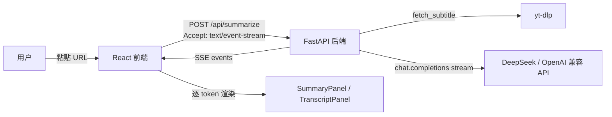
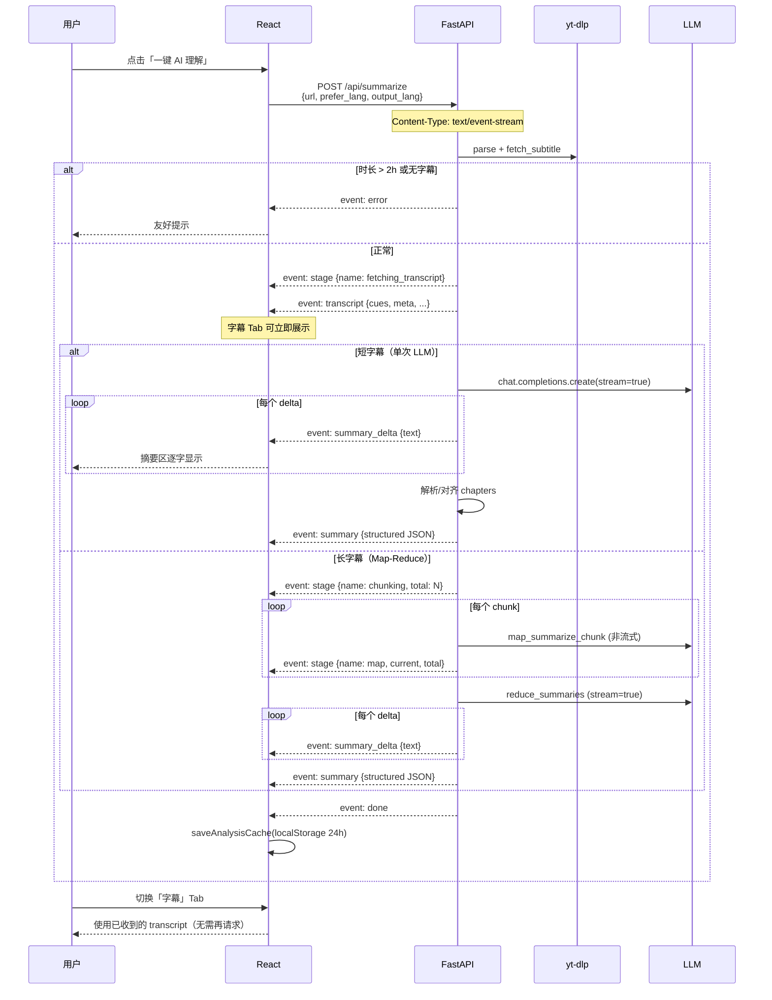

# AI 视频理解功能 · v2 技术方案（SSE 流式架构）

> **Implementation status note**: v2 design document; some phase status has been superseded by actual code. Prefer [04-ai-video-understanding-implementation.md](./04-ai-video-understanding-implementation.md) (AI) and [05-frontend-ui-implementation.md](./05-frontend-ui-implementation.md) (frontend UI). Index: [README.md](./README.md). `UnderstandingSection` in this doc was replaced by `SummarizeSSESection`.  
> **Language**: This document body is kept in Chinese as a historical archive. Authoritative English implementation docs are **04** and **05**.

> 版本：v2.0 | 状态：**待评审后重写 Phase 1**  
> 前置文档：[01-requirements-analysis.md](./01-requirements-analysis.md)、[02-ai-video-understanding-design.md](./02-ai-video-understanding-design.md)（v1，**已被本方案取代**）  
> 本文档仅做方案设计，不含代码实现。

---

## 0. 执行摘要

### 0.1 为何 v2

Phase 1 按 v1 文档实现了 **轮询式异步 analysis job**（`/api/analysis/start` → poll progress → `/result`）。用户评审后明确选择「有问题需修复」，并要求 **全部重写**。

核心诉求：**回归用户方案图中的简单链路**——

```
用户粘贴 URL → POST /api/summarize → yt-dlp 拉字幕 → LLM 流式摘要 → SSE 推送到前端（边生成边显示）
```

而非为摘要主流程引入与下载 job 同构的内存任务、轮询与多阶段 progress API。

### 0.2 v1 → v2 关键变更

| 维度 | v1 方案（02 文档 + Phase 1 实现） | v2 方案（本稿） |
| --- | --- | --- |
| **摘要主路径** | `POST /api/analysis/start` + 轮询 | **`POST /api/summarize` + SSE 流式** |
| **用户感知** | 进度条 + 完成后一次性展示 | **Token 级流式渲染**，首字秒级可见 |
| **后端复杂度** | `analysis_jobs.py` + 线程 + 缓存 clone | **单请求单连接**，无 analysis job 状态机 |
| **Transcript** | job partial / 独立 `/api/transcript` | **SSE 首事件推送 transcript**，`/api/transcript` 保留作按需拉取 |
| **思维导图** | analysis pipeline 阶段 `generating_mindmap` | **Phase 2 独立端点**；用户确认 **LLM 生成结构** |
| **Q&A** | 基于 job_id 的 `/api/chat` | **Phase 2**；`POST /api/chat` + **SSE 流式回答** |
| **服务端缓存** | `ANALYSIS_CACHE_TTL` 内存 job 缓存 | **取消**；仅 **前端 localStorage 24h** |
| **长视频** | Map-Reduce + job 进度 | **保留 Map-Reduce**；通过 SSE `stage` 事件报告分块进度 |
| **2 小时限制** | 硬拒绝（已实现） | **保持硬限制** |
| **无字幕** | 按钮 disabled + 提示 | **保持**；Whisper 仍为 Phase 4 |
| **`/api/summary`** | deprecated 同步 JSON | **保留兼容**（同步非流式 fallback） |

### 0.3 保留的产品决策（用户已确认，不变）

- 功能全集：摘要、带时间戳字幕、思维导图（LLM 生成）、AI 问答  
- 定位：下载与 AI 理解并重；同屏上下布局  
- 部署：自托管优先（后端 `.env` 持 Key）  
- v1 无 Whisper：无字幕仅提示；Phase 4 本地 faster-whisper  
- v1 不导出分析结果  
- 长视频 **≤ 2h 硬限制**  
- 缓存：**localStorage 24h**（key 按 url + prefer_lang）  
- **`/api/summary` 兼容保留**

---

## 1. 系统架构

### 1.1 总体架构（对齐用户方案图）



### 1.2 模块划分（v2 目标态）

```
backend/app/
├── main.py              # 路由：/api/summarize(SSE)、/api/summary(兼容)、/api/transcript 等
├── downloader.py        # 保留：parse、fetch_subtitle、download jobs
├── ai.py                # 扩展：流式摘要、流式 Q&A、思维导图 LLM
├── summarize_service.py # 新建：字幕拉取 → 分块 → 流式 LLM 编排（替代 analysis_pipeline）
├── transcript_utils.py  # 保留：enrich、chunk、align_chapter_times
├── config.py            # 微调：移除 ANALYSIS_CACHE_TTL 等 job 相关项
└── download_jobs.py     # 保留（下载仍用 job 轮询，与 AI 解耦）

frontend/src/
├── api.js               # streamSummarize() via fetch+ReadableStream；移除 pollAnalysis*
├── components/
│   ├── UnderstandingSection.jsx  # 重写：SSE 驱动，非轮询
│   ├── SummaryPanel.jsx          # 扩展：支持 streaming markdown + 结构化终态
│   ├── TranscriptPanel.jsx       # 保留
│   ├── StreamingProgress.jsx     # 新建：替代 AnalysisProgress（阶段 + 可选 token 指示）
│   ├── MindMapPanel.jsx          # Phase 2
│   └── ChatPanel.jsx             # Phase 2
└── utils/analysisCache.js        # 保留 localStorage 24h
```

**删除（Phase 1 重写时移除）：**

| 文件 / 端点 | 原因 |
| --- | --- |
| `analysis_jobs.py` | 轮询 job 模型不再需要 |
| `analysis_pipeline.py` | 逻辑迁入 `summarize_service.py`，去掉 job 回调 |
| `POST/GET /api/analysis/*` | 由 SSE `/api/summarize` 取代 |
| `frontend` 中 `pollAnalysis`、`startAnalysisJob` 等 | 同上 |
| `AnalysisProgress.jsx` | 由 `StreamingProgress.jsx` 替代 |

---

## 2. 核心流程（Sequence）

### 2.1 一键 AI 理解（Phase 1 主流程）



### 2.2 设计原则（v2）

1. **一条 SSE 连接完成「字幕 + 摘要」**：减少往返；Transcript 作为首个 payload 事件。  
2. **流式优先展示，结构化终态校准 UI**：Markdown/token 流提升体感；`summary` 事件携带 JSON（tldr、要点、章节）供章节时间轴渲染。  
3. **Map-Reduce 仍必要，但不引入 job**：分块 map 阶段用 `stage` 事件汇报；仅 reduce（或短视频单次）走 token 流。  
4. **下载 job 与 AI 流式彻底分离**：下载继续轮询；AI 不共用 `download_jobs` 模式。  
5. **无服务端 analysis 缓存**：刷新页面靠 localStorage；避免 job 丢失与 clone 逻辑。  
6. **Abort = 断开 SSE**：前端 `AbortController` 关闭 fetch；后端检测断开并停止向 LLM 写入（best-effort）。

---

## 3. API 设计

### 3.1 端点总览

| 方法 | 路径 | 类型 | 状态 | 说明 |
| --- | --- | --- | --- | --- |
| POST | **`/api/summarize`** | **SSE** | **v2 主入口** | 拉字幕 + 流式摘要 |
| POST | `/api/summary` | JSON 同步 | 保留 deprecated | 兼容旧客户端；内部走非流式 |
| POST | `/api/transcript` | JSON 同步 | 保留 | 仅拉字幕，不调 LLM |
| POST | `/api/subtitles` | SRT 文件 | 保留 | 导出 SRT |
| POST | `/api/translate` | SRT 文件 | 保留 | AI 翻译字幕 |
| POST | `/api/mindmap` | JSON 或 SSE | Phase 2 | LLM 生成思维导图树 |
| POST | `/api/chat` | **SSE** | Phase 2 | 基于 transcript 的多轮问答 |
| GET | `/api/health` | JSON | 微调 | 移除 `analysis_features` 中与 job 相关描述 |
| ~~POST~~ | ~~`/api/analysis/start`~~ | — | **删除** | — |
| ~~GET~~ | ~~`/api/analysis/{id}/progress`~~ | — | **删除** | — |
| ~~GET~~ | ~~`/api/analysis/{id}/result`~~ | — | **删除** | — |
| ~~POST~~ | ~~`/api/analysis/{id}/cancel`~~ | — | **删除** | 取消 = 断开 SSE |

### 3.2 POST `/api/summarize`（SSE 主入口）

**请求体：**

```json
{
  "url": "https://www.youtube.com/watch?v=...",
  "prefer_lang": "zh-Hans",
  "output_lang": "Simplified Chinese",
  "force_refresh": false
}
```

| 字段 | 说明 |
| --- | --- |
| `url` | 必填 |
| `prefer_lang` | 字幕语言偏好，默认自动 |
| `output_lang` | 摘要语言，跟随 UI 中/英 |
| `force_refresh` | 为 true 时前端忽略 localStorage，仍然后端无缓存 |

**响应头：**

```
Content-Type: text/event-stream; charset=utf-8
Cache-Control: no-cache
Connection: keep-alive
X-Accel-Buffering: no
```

**SSE 事件类型：**

| event | data 示例 | 时机 |
| --- | --- | --- |
| `stage` | `{"name":"fetching_transcript"}` | 阶段变更 |
| `stage` | `{"name":"summarizing"}` | 开始 LLM |
| `stage` | `{"name":"chunking","chunk_total":5}` | 长视频分块 |
| `stage` | `{"name":"map","chunk_current":2,"chunk_total":5}` | Map 进度 |
| `stage` | `{"name":"reducing"}` | Reduce 流式阶段 |
| `transcript` | 见 §4.1 Transcript | yt-dlp 成功后 **立即** 发送 |
| `summary_delta` | `{"text":"..."}` | LLM 流式 token 片段（Markdown 文本） |
| `summary` | 见 §4.2 VideoSummary | 流结束并解析 JSON 后发送 |
| `error` | `{"code":"no_subtitles","message":"..."}` | 不可恢复错误 |
| `done` | `{"ok":true}` | 正常结束 |

**`stage.name` 枚举：**  
`fetching_transcript` → `chunking`（可选）→ `map`（可选，可多次）→ `reducing` / `summarizing` → （隐式结束）

**错误码（`error.code`）：**

| code | HTTP | 场景 |
| --- | --- | --- |
| `invalid_url` | 400 | URL 为空 |
| `duration_exceeded` | 422 | 视频 > 2h |
| `no_subtitles` | 422 | 无可用字幕 |
| `subtitle_empty` | 422 | 字幕内容为空 |
| `llm_not_configured` | 503 | 无 LLM Key |
| `llm_failed` | 502 | LLM 调用失败 |
| `parse_failed` | 422 | yt-dlp 失败 |

> 注意：SSE 连接本身返回 200；业务错误通过 `event: error` 传递后关闭流。请求校验失败（如 URL 空）可在建立 SSE 前返回 400 JSON。

### 3.3 POST `/api/summary`（兼容）

**行为：** 同步 JSON，与现网 Phase 1 响应形状一致：

```json
{
  "title": "...",
  "lang": "en",
  "is_auto": true,
  "summary": "## Markdown ...",
  "deprecated": true
}
```

**实现：** 调用 `summarize_service.summarize_sync()`（非流式），供旧代码路径或自动化测试使用。**新前端一律走 `/api/summarize`。**

### 3.4 POST `/api/transcript`（保留）

与 Phase 1 相同：仅拉字幕，不调用 LLM。用于：

- 用户只打开字幕 Tab、尚未点「理解」时的按需加载（可选优化：理解流程已推送则可跳过）；  
- 其他客户端集成。

### 3.5 Phase 2：POST `/api/mindmap`

**请求：** `{ "url", "prefer_lang?", "output_lang", "summary"?: VideoSummary }`

- 若请求体含 `summary`，跳过重复摘要，直接生成导图；  
- 否则后端可内部拉 transcript + 调用已有 summary（非流式），或要求前端先完成 summarize。

**响应：** 建议 **单次 JSON**（思维导图为树结构，LLM JSON mode 一次返回比 token 流更稳）：

```json
{
  "mindmap": { "root": { "id": "root", "label": "...", "children": [...] } },
  "model": "deepseek-chat"
}
```

用户已确认 **LLM 生成结构**（非 v1 文档推荐的 deterministic 转换）。

### 3.6 Phase 2：POST `/api/chat`（SSE）

**请求：**

```json
{
  "url": "https://...",
  "prefer_lang": "en",
  "output_lang": "Simplified Chinese",
  "messages": [
    { "role": "user", "content": "作者在第几分钟提到 XX？" }
  ],
  "transcript": { "...": "可选，前端缓存传入避免重复拉字幕" }
}
```

**SSE 事件：**

| event | data |
| --- | --- |
| `stage` | `{"name":"retrieving"}` / `{"name":"answering"}` |
| `answer_delta` | `{"text":"..."}` |
| `answer` | `{"answer":"...","citations":[...]}` |
| `error` | 同 summarize |
| `done` | `{"ok":true}` |

**上下文策略：** 与 v1 文档一致——短视频全量 transcript 入 prompt；长视频 `transcript_utils.retrieve_chunks`（keyword Top-K）+ TL;DR。

---

## 4. 数据模型

### 4.1 Transcript（与 v1 兼容，略）

```typescript
interface Transcript {
  title: string;
  url: string;
  lang: string;
  is_auto: boolean;
  duration_sec: number | null;
  source: "subtitle" | "whisper";
  cues: TranscriptCue[];
  plain_text: string;
  char_count: number;
  truncated: boolean;  // plain_text 是否被 MAX_SUBTITLE_CHARS 截断（LLM 输入侧）
}

interface TranscriptCue {
  index: number;
  start: string;
  end: string;
  start_sec: number;
  end_sec: number;
  text: string;
}
```

### 4.2 VideoSummary（结构化终态）

```typescript
interface VideoSummary {
  tldr: string;
  key_points: string[];
  chapters: Chapter[];
  output_lang: string;
  generated_at: string;  // ISO8601
}

interface Chapter {
  title: string;
  summary: string;
  start_sec: number;
  end_sec: number;
  start_label: string;
  end_label: string;
}
```

**流式 + 结构化双轨：**

- 流式阶段：LLM 按 **Markdown 模板** 输出（用户可见），例如 `# TL;DR`、`- 要点`、`## [03:24] 章节名`；  
- 终态阶段：同一次 LLM 输出或二次 JSON 解析得到 `summary` 事件；推荐 **流式 Markdown + 结束后用已有 `summarize_structured` 非流式补全 JSON**（或流式结束后对完整文本做 JSON 提取）。实现时二选一，**默认：reduce/单次调用使用 stream 输出 Markdown，流结束后调用 `_chat_json` 精简提取 structured**（仅当 Markdown 解析不稳定时）。

更简单 **Phase 1 默认方案（推荐）**：

- 流式：直接 stream Markdown（`ai.summarize_stream_markdown`）；  
- 终态：对完整 Markdown 正则/轻量解析为 `VideoSummary`，再 `align_chapter_times`；  
- 若解析失败，fallback 调用现有 `summarize_structured`（非流式，仅补 structured，用户已看到 Markdown）。

### 4.3 MindMap（Phase 2，LLM 生成）

```typescript
interface MindMapNode {
  id: string;
  label: string;
  type: "root" | "chapter" | "point" | "detail";
  start_sec?: number;
  children: MindMapNode[];
}
```

### 4.4 前端会话状态（UnderstandingSession）

```typescript
interface UnderstandingSession {
  transcript: Transcript | null;
  summary: VideoSummary | null;
  summaryStreamText: string;      // 流式中的 Markdown 缓冲
  mindmap: MindMap | null;        // Phase 2
  chatMessages: ChatMessage[];    // Phase 2
  streaming: boolean;
  stage: string | null;
  error: string | null;
  activeTab: "summary" | "transcript" | "mindmap" | "chat";
}
```

**localStorage 缓存（24h）：** 存 `{ savedAt, session: { transcript, summary, mindmap? } }`，key=`analysis:{urlHash}:{preferLang}`（沿用 `analysisCache.js`）。

---

## 5. 前端 UX 流程

### 5.1 布局（不变）

```
ResultCard
├── Header（封面、标题、元信息）
├── Section A：下载区（清晰度、进度、下载/字幕/翻译）
└── Section B：AI 理解区（UnderstandingSection）
    ├── CTA：「一键 AI 理解」/ 流式进行中「停止」
    ├── StreamingProgress（阶段：拉字幕 → 摘要生成中）
    └── Tabs
        ├── [摘要]  SummaryPanel（流式 Markdown → 结构化卡片）
        ├── [字幕]  TranscriptPanel
        ├── [思维导图] MindMapPanel（Phase 2，lazy load）
        └── [问答]    ChatPanel（Phase 2）
```

### 5.2 交互细则

| 场景 | v2 行为 |
| --- | --- |
| 点击「一键 AI 理解」 | 打开 SSE；摘要 Tab 自动激活；`summaryStreamText` 实时更新 |
| 流式进行中 | 显示 `StreamingProgress`；摘要区 Markdown 滚动跟随；可点「停止」Abort |
| `transcript` 事件到达 | 写入 state；用户可切字幕 Tab 浏览（无需等待摘要完成） |
| `summary` 事件到达 | 用结构化数据渲染 TL;DR / 要点 / 章节时间轴；可折叠流式 Markdown |
| 无字幕 | 按钮 disabled + tooltip；不发起 SSE |
| LLM 未配置 | 503 指引；按钮 disabled |
| 时长 > 2h | SSE `error.duration_exceeded`；toast 说明硬限制 |
| 刷新页面 | 从 localStorage 恢复；无缓存则空态 |
| 重新分析 | `force_refresh` + 清 cache；新 SSE |
| 章节时间戳点击 | scroll 到 TranscriptPanel 对应 cue 高亮（Phase 1 可选，Phase 2 完善） |

### 5.3 前端 API 层（`api.js`）

```javascript
/** 解析 SSE：fetch + ReadableStream，yield { event, data } */
export async function* streamSummarize(url, { preferLang, outputLang, forceRefresh, signal }) { ... }

// 删除：startAnalysisJob, getAnalysisProgress, getAnalysisResult, cancelAnalysis, pollAnalysis

// Phase 2
export async function fetchMindmap(url, { summary, preferLang, outputLang, signal }) { ... }
export async function* streamChat(url, { messages, transcript, preferLang, outputLang, signal }) { ... }
```

**SSE 解析要点：** 按 `\n\n` 分块，解析 `event:` / `data:` 行；`data` 为 JSON；支持 `AbortSignal`。

### 5.4 组件变更

| 组件 | 动作 |
| --- | --- |
| `UnderstandingSection.jsx` | **重写**：消费 `streamSummarize`，管理 session state |
| `SummaryPanel.jsx` | **扩展**：`streamingText` prop + 终态 `summary` |
| `StreamingProgress.jsx` | **新建**：展示 `stage`（替代 `AnalysisProgress.jsx`） |
| `TranscriptPanel.jsx` | **保留** |
| `AnalysisProgress.jsx` | **删除** |
| `MindMapPanel.jsx` | Phase 2 新建 |
| `ChatPanel.jsx` | Phase 2 新建 |

---

## 6. 后端实现要点

### 6.1 新模块 `summarize_service.py`

| 函数 | 职责 |
| --- | --- |
| `async def stream_summarize(url, prefer_lang, output_lang) -> AsyncIterator[SseEvent]` | 主编排：校验 → fetch_subtitle → yield transcript → 分块判断 → 流式 LLM |
| `def fetch_transcript_for_url(url, prefer_lang) -> tuple[Transcript, meta]` | 从 `analysis_pipeline.fetch_transcript_only` 迁入（含 2h 校验） |
| `def summarize_sync(...)` | 供 `/api/summary` 兼容 |

**依赖保留：** `downloader`、`transcript_utils`、`ai`（新增流式方法）。

### 6.2 `ai.py` 扩展

| 函数 | 说明 |
| --- | --- |
| `summarize_stream_markdown(title, transcript, output_lang) -> Iterator[str]` | `stream=True`，yield content delta |
| `summarize_structured(...)` | **保留**（Map-Reduce、fallback、/api/summary） |
| `map_summarize_chunk` / `reduce_summaries` | **保留**（长视频） |
| `reduce_summaries_stream(...)` | Phase 1：reduce 阶段流式 Markdown |
| `generate_mindmap_llm(...)` | Phase 2 |
| `answer_question_stream(...)` | Phase 2 |
| `translate_cues` | **保留** |

### 6.3 长视频策略（≤ 2h 硬限制）

| 条件 | 策略 |
| --- | --- |
| `duration > 7200s` | **拒绝**，SSE `error.duration_exceeded` |
| `plain_text ≤ MAX_SUBTITLE_CHARS` 且时长 ≤ 20min | 单次 `summarize_stream_markdown` |
| 否则 | `chunk_transcript` → N 次 `map_summarize_chunk`（SSE `stage.map`）→ `reduce_summaries_stream` |

Map 阶段非流式（局部 JSON 小），reduce 阶段流式（用户主要等待点）。

### 6.4 无字幕路径（v1）

1. `fetch_subtitle` 无 cues → SSE `error.no_subtitles`；  
2. 文案：「该视频无可用字幕，暂无法 AI 理解」+ Whisper Phase 4 说明；  
3. **不**尝试 LLM 无文本摘要。

### 6.5 `config.py` 变更

```env
# 保留
MAX_SUBTITLE_CHARS=16000
CHUNK_MAX_CHARS=6000
MAX_ANALYSIS_DURATION_SEC=7200

# 删除
ANALYSIS_CACHE_TTL=...   # 不再需要服务端 analysis 缓存

# Phase 4 预埋（不变）
WHISPER_MODE=off
```

### 6.6 FastAPI SSE 实现 sketch

使用 `StreamingResponse` + async generator；每个事件：

```python
yield f"event: transcript\ndata: {json.dumps(payload, ensure_ascii=False)}\n\n"
```

在 `Request.is_disconnected()` 或 generator `finally` 中停止 LLM iterator。

---

## 7. 分阶段实施计划

### Phase 1 重写（P0，约 1 周）— SSE 摘要 + 字幕 Tab

| # | 任务 |
| --- | --- |
| 1.1 | 新建 `summarize_service.py` + `ai.summarize_stream_markdown` |
| 1.2 | `main.py`：`POST /api/summarize`（SSE）；删除 `/api/analysis/*` |
| 1.3 | 删除 `analysis_jobs.py`、`analysis_pipeline.py` |
| 1.4 | `/api/summary` 改调 `summarize_sync` |
| 1.5 | 前端 `streamSummarize` + 重写 `UnderstandingSection` |
| 1.6 | `StreamingProgress` + `SummaryPanel` 流式支持 |
| 1.7 | 保留 `analysisCache.js`；移除 poll 相关 API |
| 1.8 | 测试：SSE 集成测试（mock yt-dlp + mock LLM stream）、`transcript_utils` 单测保留 |

**验收：** 有字幕视频一键理解 → 摘要边生成边显示；字幕 Tab 可用；2h/无字幕/无 Key 错误清晰；localStorage 24h 恢复。

### Phase 2（P1，约 1 周）— 思维导图 + Q&A

| # | 任务 |
| --- | --- |
| 2.1 | `ai.generate_mindmap_llm` + `POST /api/mindmap` |
| 2.2 | `ai.answer_question_stream` + `POST /api/chat`（SSE） |
| 2.3 | `transcript_utils.retrieve_chunks`（Q&A 长视频） |
| 2.4 | 前端 `MindMapPanel`（React Flow，lazy）、`ChatPanel` |
| 2.5 | Tab 扩展；章节/引用 → Transcript 高亮 |

**验收：** LLM 导图可交互；问答流式回答带 citations。

### Phase 3（体验，约 0.5 周）

- TranscriptPanel 虚拟列表（>500 cues）  
- 错误重试、空状态、skeleton 优化  
- i18n 补全  
- README / 文档回写  

### Phase 4（可选）— Whisper

- `downloader.extract_audio` + faster-whisper 本地  
- 无字幕时 transcript `source: whisper` 后接入同一 `/api/summarize` SSE 链路  

### Phase 5（后续）— SaaS

- 多租户 Key、用量、DB 持久化（不在 v2 范围）

---

## 8. 文件级变更清单

### 8.1 删除

```
backend/app/analysis_jobs.py
backend/app/analysis_pipeline.py
frontend/src/components/AnalysisProgress.jsx
```

### 8.2 修改

| 文件 | 变更 |
| --- | --- |
| `backend/app/main.py` | +`/api/summarize` SSE；−`/api/analysis/*`；health 字段更新 |
| `backend/app/ai.py` | +流式摘要/Q&A；保留 structured/map/reduce |
| `backend/app/config.py` | −`analysis_cache_ttl` |
| `backend/.env.example` | −`ANALYSIS_CACHE_TTL`；文档说明 SSE |
| `frontend/src/api.js` | +`streamSummarize`；−poll 系列 |
| `frontend/src/components/UnderstandingSection.jsx` | SSE 重写 |
| `frontend/src/components/SummaryPanel.jsx` | 流式 Markdown |
| `frontend/src/i18n.jsx` | 流式/停止/阶段文案 |
| `docs/02-ai-video-understanding-design.md` | 文首标注「已被 v2 取代」 |

### 8.3 新增

```
backend/app/summarize_service.py
frontend/src/components/StreamingProgress.jsx
frontend/src/components/MindMapPanel.jsx      # Phase 2
frontend/src/components/ChatPanel.jsx         # Phase 2
backend/tests/test_summarize_sse.py           # Phase 1
docs/03-ai-video-understanding-v2-design.md   # 本文档
```

### 8.4 保留不动（核心资产）

```
backend/app/downloader.py
backend/app/download_jobs.py
backend/app/transcript_utils.py
backend/tests/test_transcript_utils.py
frontend/src/components/TranscriptPanel.jsx
frontend/src/components/ResultCard.jsx         # 仅 UnderstandingSection 子树变
frontend/src/utils/analysisCache.js
```

---

## 9. 测试计划

### 9.1 后端

| 类型 | 内容 |
| --- | --- |
| 单元 | `transcript_utils`（已有）；`parse_markdown_to_summary`（若新增）；`retrieve_chunks`（Phase 2） |
| SSE 集成 | TestClient 读 SSE 流：mock `fetch_subtitle` → 断言事件顺序 `stage` → `transcript` → `summary_delta`* → `summary` → `done` |
| 错误路径 | 无字幕、超 2h、LLM 失败 → `event: error` |
| 兼容 | `POST /api/summary` 仍返回 JSON + `deprecated: true` |
| Map-Reduce | fixture 超长字幕 → 断言 `stage.map` 次数 + 最终 `summary` |

### 9.2 前端

MVP 手动清单：

| # | 场景 |
| --- | --- |
| 1 | 有字幕 YouTube：流式摘要可见；完成后章节卡片正确 |
| 2 | 流式中切换字幕 Tab：transcript 已就绪 |
| 3 | 点击停止：SSE 中断，无残留 loading |
| 4 | 刷新：localStorage 恢复 |
| 5 | 无字幕 / 超 2h / 无 Key |
| 6 | 中英文 UI 切换后 `output_lang` 正确 |
| 7 | Phase 2：问答流式 + 导图渲染 |

Phase 2+ 可引入 Vitest 测 `streamSummarize` 解析器与 `SummaryPanel`。

### 9.3 手工 LLM 验收

同 v1：短教程（5–10min）、中文 30min+（Map-Reduce + 流式 reduce）、无字幕 MV。

---

## 10. 风险与缓解

| 风险 | 缓解 |
| --- | --- |
| SSE 被反向代理缓冲 | `X-Accel-Buffering: no`；nginx `proxy_buffering off` |
| 流式 Markdown 无法解析为 structured | fallback `summarize_structured`；UI 仍展示 Markdown |
| 长视频 Map 阶段等待无 token | `stage.map` 进度条 + 文案「正在分析第 k/n 段」 |
| 连接断开 LLM 仍计费 | best-effort cancel iterator；文档说明 |
| React Flow 体积 | lazy import MindMapPanel |
| 与下载并发 | 独立连接，无共享 job 锁 |

---

## 11. 开放问题（建议默认）

| # | 问题 | 建议默认 |
| --- | --- | --- |
| Q1 | 流式展示 Markdown 还是 JSON token？ | **Markdown 流式** + 终态 structured 事件 |
| Q2 | `/api/summarize` vs 复用 `/api/summary` 加 `Accept: text/event-stream` | **新路径 `/api/summarize`**；`/api/summary` 仅同步兼容 |
| Q3 | 思维导图是否 SSE？ | **单次 JSON**（结构一次性返回更稳） |
| Q4 | Q&A 是否必须传 transcript？ | 前端有则传，避免重复 yt-dlp；否则后端自拉 |
| Q5 | nginx 生产部署文档？ | Phase 1 在 README 增加 SSE 配置 snippet |

---

## 12. 文档关系

| 文档 | 关系 |
| --- | --- |
| [01-requirements-analysis.md](./01-requirements-analysis.md) | 业务需求；F3 实现方式更新为 SSE |
| [02-ai-video-understanding-design.md](./02-ai-video-understanding-design.md) | **历史 v1 方案**；轮询 job 设计作废 |
| **本文档 03** | **当前权威方案**；Phase 1 重写依据 |

**实施完成后回写：** `01` §3.3 状态、`README` AI 理解说明、`.env.example` 注释。

---

*文档版本：v2.0 | 架构决策：SSE 流式为主，删除 analysis job 轮询*
